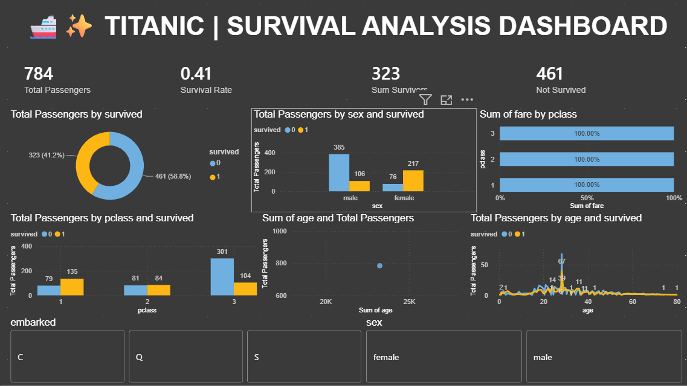

# Titanic-Data-Analysis-and-Visualization

# 🚢 Titanic Survival Prediction and Data Visualization

## 📌 Project Overview

This project focuses on **Titanic passenger data analysis, data visualization, and survival prediction** using Python, Machine Learning, and Power BI.

The project includes data cleaning, Exploratory Data Analysis (EDA), data visualization, multiple Machine Learning models, model evaluation, and an interactive Power BI dashboard.

## 🎯 Project Objectives

* Data Cleaning
* Exploratory Data Analysis
* Data Visualization
* Machine Learning Model Building
* Model Accuracy Comparison
* Best Model Selection
* Passenger Survival Prediction
* Power BI Dashboard Development

## 🛠️ Tools and Technologies

* Python
* Pandas
* NumPy
* Matplotlib
* Seaborn
* Scikit-learn
* Joblib
* Power BI
* VS Code

## 📂 Project Structure

```text
Titanic-Data-Analysis-and-Visualization/

├── Cleaned_Data/
│   └── titanic_cleaned.csv
│
├── DataLoad/
│   └── Titanic.py
│
├── ML/
│   └── ml.py
│
├── Model/
│   ├── titanic_best_model.pkl
│   └── titanic_scaler.pkl
│
├── models/
│   └── titanic_best_model.pkl
│
├── PowerBI/
│   ├── titanic_powerbi_dashboard.pbix
│   └── titanic_powerbi_dashboard.png
│
├── Visualization/
│   ├── Age_boxplot.png
│   ├── Age_distribution.png
│   ├── Confusion_matrix.png
│   ├── Correlation_Heatmap.png
│   ├── Fare_boxplot.png
│   ├── Fare_distribution.png
│   ├── gender vs survival.png
│   ├── Model_accuracy_visualization.png
│   └── Survival visualization.png
│
└── README.md
```

## 🧹 Data Cleaning

The Titanic dataset was cleaned and prepared for analysis.

* Handled missing values
* Checked data types
* Checked duplicate records
* Removed unnecessary data
* Prepared numerical features
* Prepared categorical features
* Saved the cleaned dataset

## 🔍 Exploratory Data Analysis

The following features were analyzed:

* Passenger Class
* Gender
* Age
* SibSp
* Parch
* Fare
* Embarked
* Survival

## 📊 Data Visualization

The project contains the following visualizations:

* Age Distribution
* Age Boxplot
* Fare Distribution
* Fare Boxplot
* Gender vs Survival
* Survival Visualization
* Correlation Heatmap
* Confusion Matrix
* Model Accuracy Visualization

## 🤖 Machine Learning Models

Five classification models were trained:

### 1. Logistic Regression

Used as a classification model to predict passenger survival.

### 2. K-Nearest Neighbors

Used to classify passengers based on similar observations.

### 3. Decision Tree

Used to predict survival using decision-based rules.

### 4. Random Forest

An ensemble classification algorithm using multiple decision trees.

### 5. Support Vector Machine

Used for classification of survived and not-survived passengers.

## ⚙️ Machine Learning Workflow

```text
Data
↓
Data Cleaning
↓
Feature and Target Separation
↓
Categorical Encoding
↓
Train-Test Split
↓
Feature Scaling
↓
Model Training
↓
Prediction
↓
Accuracy Comparison
↓
Best Model Selection
↓
New Passenger Prediction
```

## 🔤 Feature Encoding

Categorical features such as `sex` and `embarked` were encoded using:

```python
pd.get_dummies()
```

## 📏 Feature Scaling

`StandardScaler` was used for feature scaling.

Scaling was applied to:

* Logistic Regression
* KNN
* SVM

## 📈 Model Evaluation

The models were evaluated using **Accuracy Score**.

The accuracy of all five models was compared using a bar chart.

## 🏆 Best Model

The model with the highest accuracy was selected automatically.

The trained Random Forest model was saved as:

```text
titanic_best_model.pkl
```

## 💾 Model Saving

The trained model and scaler were saved using **Joblib**.

```text
Model/

├── titanic_best_model.pkl
└── titanic_scaler.pkl
```

## 🔮 New Passenger Prediction

A sample passenger was created using:

* Pclass
* Sex
* Age
* SibSp
* Parch
* Fare
* Embarked

The trained model was then used to predict the passenger's survival outcome.

## 📊 Power BI Dashboard

An interactive **Titanic Power BI Dashboard** was created to visualize important insights.

### Dashboard Includes

* Total Passengers
* Total Survivors
* Survival Rate
* Gender-wise Survival
* Passenger Class Analysis
* Age Analysis
* Fare Analysis
* Embarkation Analysis
* Interactive Slicers
* Data Visualizations

## 📸 Dashboard Preview



## 📁 Dataset

The cleaned Titanic dataset is available here:

```text
Cleaned_Data/titanic_cleaned.csv
```

## 📌 Skills Demonstrated

* Data Cleaning
* Exploratory Data Analysis
* Data Visualization
* Feature Encoding
* Feature Scaling
* Machine Learning
* Model Evaluation
* Model Comparison
* Model Saving
* Prediction
* Power BI Dashboard Development

## 🎯 Project Outcome

This project demonstrates an end-to-end workflow using **Python, Machine Learning, Data Visualization, and Power BI** to analyze Titanic passenger data and predict survival outcomes.

## 👨‍💻 Author

**Jyoti.IO**

## 🚀 Project Technologies

#Python #Pandas #NumPy #Matplotlib #Seaborn #MachineLearning #ScikitLearn #PowerBI #DataAnalysis #DataVisualization #Titanic #DataScience
